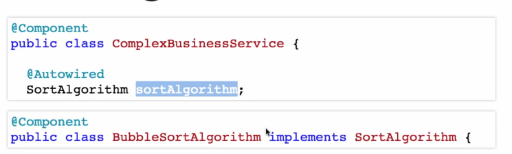
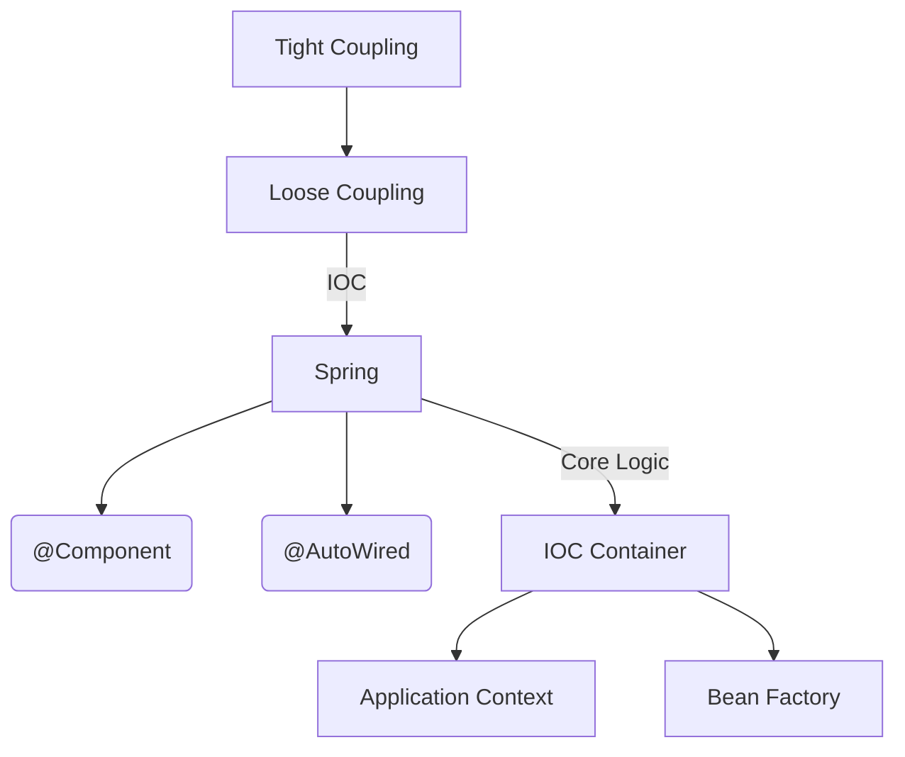
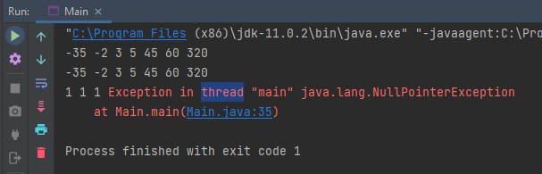

# Spring
    Spring is a dependency injection framework.

## Dependency Injection:

## Autowired:
Spring start looking for the dependency among the components to find a matching thing for the annotated stuff.
## Component:
Spring knows it needs to create, manage the instances of annotated class.
## IOC: Inversion of control:
The Spring Framework create the instance of dependency instead of the class.

## IOC Container:
A generic terminology to represent anything that is implementing Inversion Of Control.
## Application Context:
Typical IOC container (in the case of Spring Framework). The one where all the beans are created and managed, where all the Core Logic of SpringFramework happens.

## MindMap

# Questions?
- Why did he say beans are instances of annotated classes with @Component and not the methods annotated with @Bean ???
- What is the problem here?
